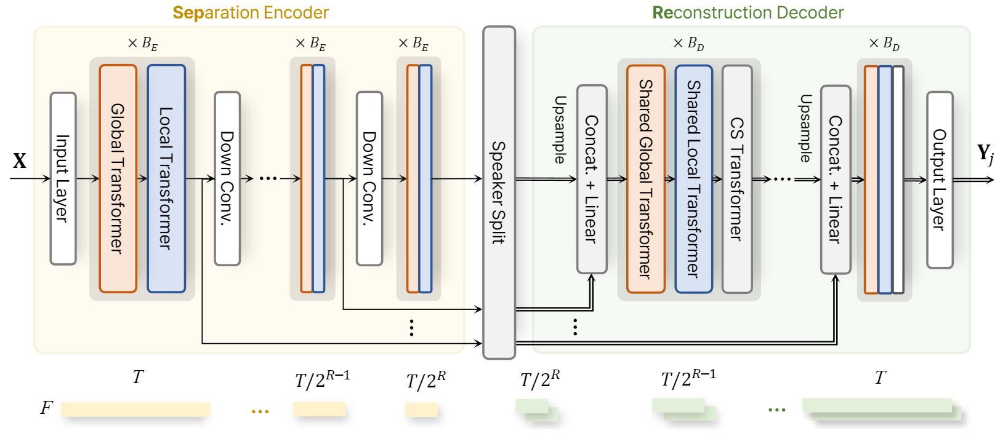
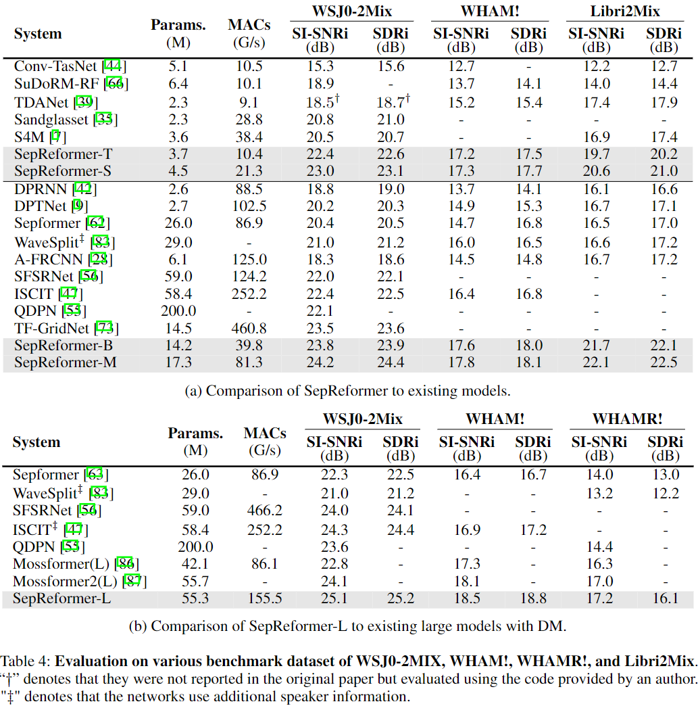
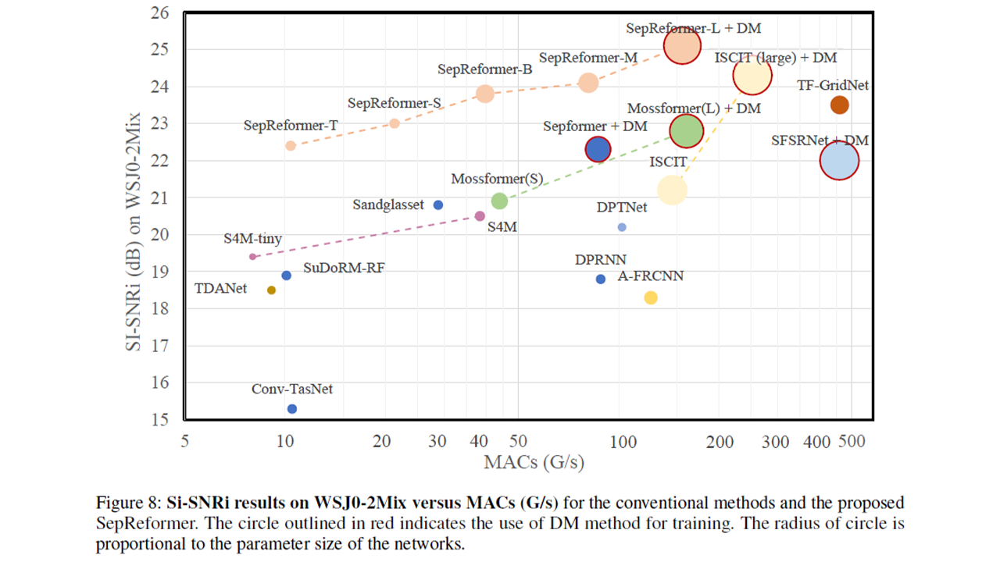

# SepReformer for Speech Separation [NeurIPS 2024]


This is the official implementation of “Separate and Reconstruct: Asymmetric Encoder-Decoder for Speech Separation” accepted in NeurIPS 2024 [Paper Link(Arxiv)](https://arxiv.org/abs/2406.05983)

[](https://paperswithcode.com/sota/speech-separation-on-wsj0-2mix?p=separate-and-reconstruct-asymmetric-encoder)
[](https://paperswithcode.com/sota/speech-separation-on-wham?p=separate-and-reconstruct-asymmetric-encoder)
[](https://paperswithcode.com/sota/speech-separation-on-whamr?p=separate-and-reconstruct-asymmetric-encoder)


## News

🔥 October, 2024: We have added feature for single audio inference on our SepReformer-B for WSJ0-2MIX in `models/SepReformer_Base_WSJ0`. You can directly inference by your own samples!

🔥 October, 2024: We have uploaded the pre-trained models of our SepReformer-B for WSJ0-2MIX in `models/SepReformer_Base_WSJ0/log/scratch_weight` folder! You can directly test the model using the inference command below.

🔥 September 2024, Paper accepted at NeurIPS 2024 🎉.


## Todo
We are planning to release the other cases especially for partially or fully overlapped, noisy-reverberant mixture with 16k of sampling rates for practical application within this year.




We  propose SepReformer, a novel approach to speech separation using an asymmetric encoder-decoder network. 

Demo Pages: [Sample Results of speech separation by SepReformer](https://dmlguq456.github.io/SepReformer_Demo/)


## Environment Preparation
```bash
conda create -n SepReformer python=3.10
conda activate SepReformer
pip install -r requirements.txt
```


## Pretrained Models

We offer a pretrained model for our SepReformer-B. (other models will be uploaded, soon)

This repository uses **Git LFS (Large File Storage)** to manage pretrained model files. If Git LFS is not installed, large files may not be downloaded properly. **Please install Git LFS before cloning this repository.**

- Installing and Setting Up Git LFS

1. **Install Git LFS**

   Git LFS is an extension for Git that allows handling large files. You can install it, for example in Ubuntu, with the following commands:

     ```bash
     sudo apt update
     sudo apt install git-lfs
     ```
2. **Initialize Git LFS**

   Before cloning the repository, initialize Git LFS with the following command:

   ```bash
   git lfs install
   ```   

## Data Preparation

- For training or evaluation, you need dataset and scp file
    1. Prepare dataset for speech separation (eg. WSJ0-2mix)
    2. create scp file using data/create_scp/*.py

## Training

- If you want to train the network, you can simply trying by
    - set the scp file in ‘models/SepReformer_Base_WSJ0/configs.yaml’
    - run training as
        
        ```bash
        python run.py --model SepReformer_Base_WSJ0 --engine-mode train
        ```

### Inference on a single audio sample

- Simply Inference on a single audio with output wav files saved

    ```bash
    python run.py --model SepReformer_Base_WSJ0 --engine-mode infer_sample --sample-file /to/your/sample/dir/
    ```

- For example, you can directly test by using the included sample as

    ```bash
    python run.py --model SepReformer_Base_WSJ0 --engine-mode infer_sample --sample-file ./sample_wav/sample_WSJ.wav
    ```


## Test on Dataset

- Evaluating a model on dataset without saving output as audio files
    
    ```bash
    python run.py --model SepReformer_Base_WSJ0 --engine-mode test
    ```
    

- Evaluating on dataset with output wav files saved
    
    ```bash
    python run.py --model SepReformer_Base_WSJ0 --engine-mode test_wav --out_wav_dir '/your/save/directoy[optional]'
    ```
    

## Training Curve
- For SepReformer-B with WSJ-2MIX, the training and validation curve is as follows:


<br />
<br />





## Citation

If you find this repository helpful, please consider citing:
```
@inproceedings{
shin2024separate,
title={Separate and Reconstruct: Asymmetric Encoder-Decoder for Speech Separation},
author={Ui-Hyeop Shin and Sangyoun Lee and Taehan Kim and Hyung-Min Park},
booktitle={The Thirty-eighth Annual Conference on Neural Information Processing Systems},
year={2024},
url={https://openreview.net/forum?id=99y2EfLe3B}
}
```
